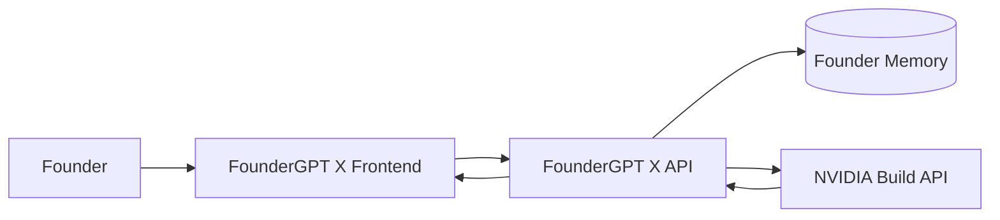

# FounderGPT X Architecture

FounderGPT X is The AI Operating System for Founders, not a generic chat app. The product is split into a Next.js frontend, a FastAPI backend, PostgreSQL persistence, and an AI orchestration layer that uses NVIDIA Build API through an OpenAI-compatible client.

Brand tagline: Build. Validate. Launch. Fund.

Hero message: From idea to funded startup. AI-powered. Founder-first.

## Major Decisions

1. Frontend and backend are separate applications.
   This keeps Clerk session handling, premium product UI, and server-rendered pages in Next.js while giving the AI, persistence, exports, and background workflows a Python service boundary.

2. The backend owns founder memory.
   Chat messages, project strategy, generated documents, tasks, roadmaps, and agent outputs are stored server-side. The frontend only renders and submits validated inputs.

3. AI agents are configured, not hardcoded in routes.
   Each agent has a role, operating style, system prompt, and output contract. This lets the product evolve from single-agent guidance to boardroom collaboration without rewriting the API surface.

4. NVIDIA API access is isolated in one service.
   API keys are read from environment variables and never passed to the frontend. The service provides retry-safe request boundaries and structured error handling.

5. Phase 1 optimizes for durable primitives.
   Authentication, projects, chat, memory, and agent routing come before generators. Business plans, pitch decks, market research, and exports build on the same primitives later.

## Runtime Boundaries

- `frontend/`: Next.js 15, React, TypeScript, TailwindCSS, Framer Motion, shadcn-compatible components.
- `backend/`: FastAPI, Pydantic, SQLAlchemy, PostgreSQL, NVIDIA/OpenAI-compatible client.
- `backend/alembic/`: Alembic migrations for PostgreSQL.
- `database/`: schema documentation and migration notes.
- `api/`: API contract documentation.
- `prompts/` and `agents/`: canonical agent definitions and prompt strategy.

## Architecture Diagram

## Request Flow

1. Founder signs in with Clerk in the Next.js app.
2. Frontend sends Clerk JWT to FastAPI.
3. FastAPI validates JWT, validates payloads with Pydantic, and loads project memory from PostgreSQL.
4. Agent service builds a context package from project memory, conversation history, selected agent prompt, and requested workflow.
5. NVIDIA Build API returns the response through the backend.
6. Backend stores the assistant response, memory deltas, and structured artifacts.
7. Frontend renders the result with loading, empty, and error states.

## Product Modules

- Dashboard: founder command center, project health, next actions, runway, risks.
- Projects: startup profile, description, stage, target users, market, competitors, revenue model, owner-scoped memory.
- AI Chat: multi-agent advice with challenge-oriented behavior.
- Business Plan: structured generated artifact backed by project memory.
- Pitch Deck: slide outline, narrative, export-ready content.
- Market Research: market size, persona, competitors, positioning.
- Investor CRM: investors, stages, notes, tasks, follow-ups.
- Tasks: OKRs, weekly planning, daily missions, risk-driven next actions.
- Documents: generated and uploaded assets with export metadata.
- Settings: account, organization, billing-ready preferences, API diagnostics.

## Security Baseline

- Clerk JWT validation on every protected backend route.
- Clerk middleware protects frontend dashboard and project routes when Clerk is configured.
- Environment-only secret loading.
- Request size limits and Pydantic validation.
- Rate limiting is a production-release requirement and is tracked separately.
- Structured logs with request IDs and no secret payloads.
- CORS restricted by environment configuration.

## Near-Term Non-Goals

- No all-in-one Streamlit prototype expansion.
- No frontend access to NVIDIA credentials.
- No generated artifacts without persisted project context.
- No fake investor or market data presented as verified research.

## Audit Notes

The supported production runtime is `frontend/` plus `backend/`. Root-level Python prototype files are retained only as historical context and should not receive new product work.
